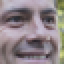
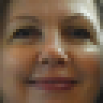
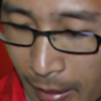

# MakeFacesGreatAgain

This repository contains practical part of my [masters thesis](https://www.overleaf.com/read/rmkmpnsbbdpv) focused on face super-resolution. I try to keep the implementation as modular as possible, so the solvers are abstract classes and every architecture implements its loss. For computing face identity distance, I use dlib library with models from [this repository](https://github.com/davisking/dlib-models) and pretrained SE-ResNet architecture from [VGG-Face2 repository](https://github.com/ox-vgg/vgg_face2).

### Run

To use neural networks on NVIDIA GPU, ensure that you have proper NVIDIA and CUDA drivers installed.

To install Python modules, use: `pip install -r requirements.txt`.

To start training, run `./main.py config_path` with path to configuration file as the only argument.

### Configuration file format

Configuration format can be found in `configs` folder with examples for each architecture. Edit the paths to dataset before training.

### Datasets

For training I use [CelebA](http://mmlab.ie.cuhk.edu.hk/projects/CelebA.html) (aligned, cropped to 208x176) and  [FFHQ](https://github.com/NVlabs/ffhq-dataset) (resized to 256x256) dataset. Implementation of dataset encapsulating objects can be found in `datasets` folder.

### Serialized file format

After given amount of iterations snapshot of model is created using `torch.load()` function. To load snapshot, call `torch.save()` with correct arguments. Saved object is a dictionary with these keys and values:

- **model_name <str>:** name of architecture

- **model <dict>:** model state

- **optimizer <dict>:** optimizer state

- **scheduler <dict>:** scheduler state

- **iteration <int>:** number of iterations after which model was saved

- **upscale <int>:** scaling factor

### Results

Examples of cropped images enlarged by proposed architecture with respective input images. These images are part of FFHQ dataset.

   

  
